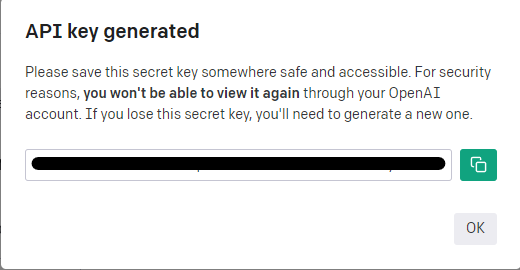

# Python-Voice-Assistant

A Python-based voice assistant that can greet you and perform a variety of tasks, including searching the web, opening social media, and creating a to-do list.


<div align="center">
 <p>

[](https://github.com/ellerbrock/open-source-badges/)


  


 </p>
</div>

## How does this code work?

This voice assistant is built using a combination of various Python packages, making it easy for you to use and access a wide range of functionality.

## Installation

To install the required dependencies, use pip by running:

```sh
pip install -r requirements.txt
```

### Script-based Installation

An alternative method for easy installation is to use the provided scripts.
To install all necessary dependencies, run the script corresponding to your operating system:

#### Windows

```sh
cd /your_path/Python-Voice-Assistant
./Setup.bat
```

#### Unix-based/Linux

```sh
cd /your_path/Python-Voice-Assistant
./Setup.sh
```

## Using ChatGPT

To use ChatGPT, you would need an API key. To get the API Key follow the steps below.

### Getting API Keys

1. First go to [https://openai.com/](https://openai.com/)


2. Now click on API and Sign Up and make sure to state that the account is for Personal works.
3. Now go to Manage Accounts and go to Usage to make sure you have some free credits.


4. Now go to API Keys and generate an API key.




5. Copy and paste the API Key in the code.


## Contributing

If you have a suggestion that would make this better, please fork the repo and create a pull request. You can also open an issue with the tag `enhancement`.

1. Fork the Repository.
2. Create your Feature Branch. `git checkout -b feature/feature-name`
3. Commit your Changes. `git commit -s -m "Add some AmazingFeature"`
4. Push to the Branch. `git push origin feature/feature-name`
5. Open a Pull Request.

## Contributors

[](https://github.com/subhadip-saha-05/PythOn-voice-assistant/graphs/contributors)
